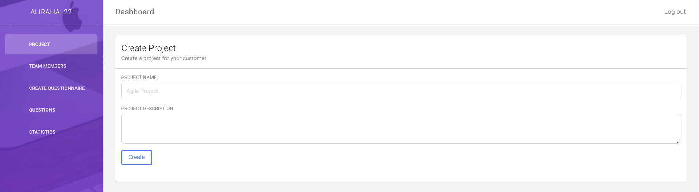
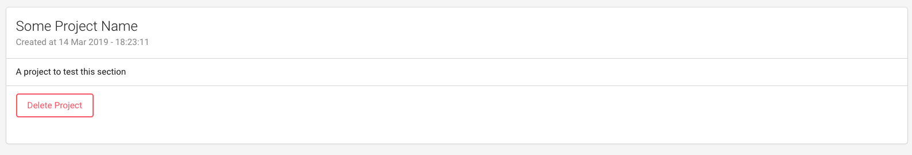
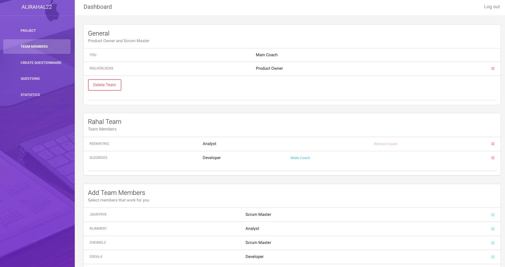
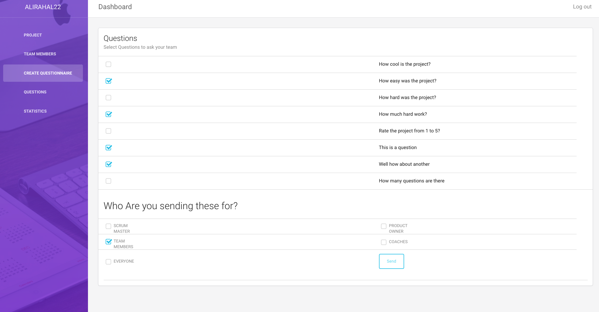
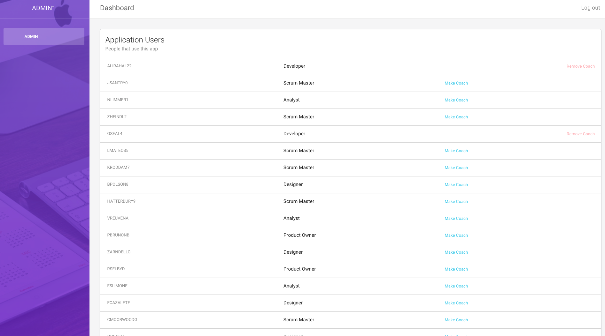

# ProGile
A project management web app.
A coach can pick team members and ask questions to assess the current progress.
He can also allow team members to have their own teams if he wishes so.

## Coach
* Each coach can have one team
* Coach can allow members to have their own teams (make them a coach)
* Coach can ask questions

__________________________________________________________

__________________________________________________________

__________________________________________________________

## Team members
* Only able to answer questions
* Questions are answered with a 1 to 5 rating, they can also write an answer

## Admin panel
* Admin selects and removes coaches

